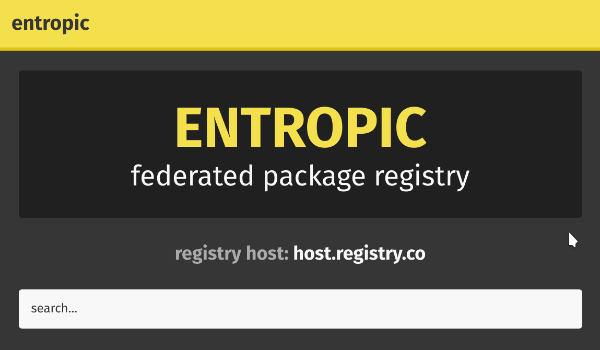

# entropic/web

<br />
<br />
<p align="center">
  
</p>
<br />

Entropic's website ~~goes~~ **is** here.

**DISCLAIMER:** This **is not** Entropic's live site (found at [https://entropic.dev](https://entropic.dev)). The source for that site can be found in the [`registry`](../registry) directory in the parent repo.

## TODO

- [x] webpack config
- [ ] logo design
- [ ] theme design (colors + layout)
- [ ] network interface
  - [ ] backend implementation (replace [`../registry/handlers/www.js`](../registry/handlers/www.js))
  - [ ] frontend implementation (xhr sending/receiving)
- [ ] splash page
- [ ] package search page
- [ ] package detail page

## Usage

This repository is setup as a standard React application - each route renders a page from the `pages` directory, which in turn contains some number of components from the `components` directory. This project leverages the following technologies:

- `webpack` for bundling
- `@reach/router` for client-side routing
- `typescript` for static typing
- `react` for component design
- `styled-components` for, well, component styling
- `jest` via `ts-jest` for testing

## SEO Optimization

This repo contains a basic PoC server to illustrate how SEO information could be rather easily injected without sacrificing much overhead server-side.

To try it out, simply build the project and then run the SEO server.

```
npm run build:prod
cd server
npm start
```

## Scripts

### `npm run start`

Start a local development server using `webpack-dev-middleware`. This server will serve the application on `process.env.PORT` (default `3000`) and automatically reload when filesystem changes are detected. Hot reloading is supported.

### `npm run build` / `npm run build:prod`

Generate a development or production bundle, respectively, and write it out to `build` along with any other build artifacts.

### `npm run lint` / `npm run lint-fix`

Check the source for any linting errors and fix any formatting errors, respectively. Please run both of these scripts before submitting a PR for review to minimize nitpicky PR comments :)

### `npm run test` / `npm run test:watch`

Run all unit tests, either in a single batch run or in watch mode. We use `jest` via `ts-jest` for running tests, along with `enzyme` for React component DOM inspection.
